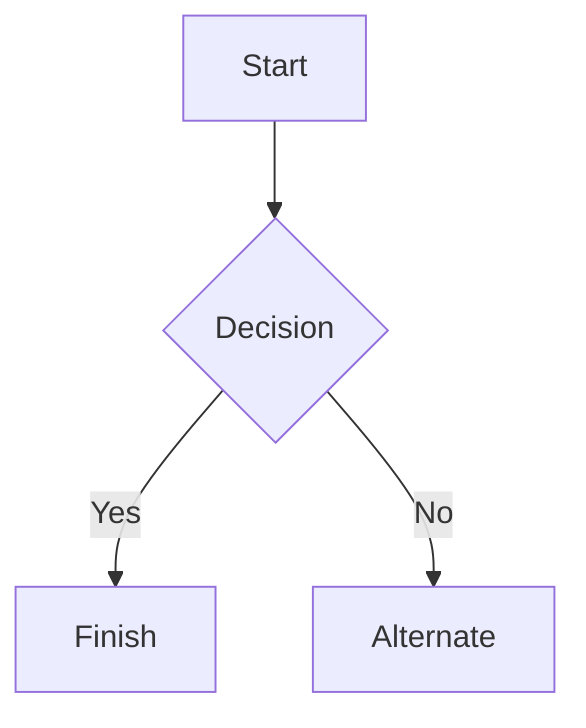

# Welcome to my Blog
__This is where I post new things I am working on, new things I have learned, and thoughts my chaotic mind conjures up.__

## What I am currently doing
Currently, I am learning C and WASM while building this webpage. I tried working in pure JavaScript and HTML before, and I was not enjoying myself. Working in those languages was a messy process that I didn't enjoy, but the C and WASM experience is much more my style of programming.

The webpage is built with [Clay](https://github.com/nicbarker/clay), [cJSON](https://github.com/DaveGamble/cJSON), and [md4c](https://github.com/mity/md4c).


### Odin
I am also diving into [Odin Lang](https://odin-lang.org/) because I really like the syntax and thought features like swizzling and the ability to set matrices to different value types (like `int`, `uint`, or `f64`) are really cool! I am currently trying to write a virtual file system in the language, to then either write my own little game engine on the side using SDL3 or Raylib in Odin. I haven't picked which backend I want to use yet, but I might also just use the VFS as a library via interop with another language just to test how that works.

So far, I have managed to create a custom archive format similar to what Quake 1 used.
I figured out how to pack the files; now I just need to implement reading them as well.

### C#
I already have a project working on a C# Raylib engine, and I might implement an Odin interop VFS system for it just for fun!


### This is another test document to make sure the website works correctly.

# Markdown syntax guide

## Headers

# This is a Heading h1
## This is a Heading h2
###### This is a Heading h6

## Emphasis

*This text will be italic*  
_This will also be italic_

**This text will be bold**  
__This will also be bold__

_You **can** combine them_

## Lists

### Unordered

* Item 1
* Item 2
* Item 2a
* Item 2b
    * Item 3a
    * Item 3b

### Ordered

1. Item 1
2. Item 2
3. Item 3
    1. Item 3a
    2. Item 3b

## Images


## Links

You may be using [Markdown Live Preview](https://markdownlivepreview.com/).

## Blockquotes

> Markdown is a lightweight markup language with plain-text-formatting syntax, created in 2004 by John Gruber with Aaron Swartz.
>
>> Markdown is often used to format readme files, for writing messages in online discussion forums, and to create rich text using a plain text editor.

## Tables

| Left columns  | Right columns |
| ------------- |:-------------:|
| left foo      | right foo     |
| left bar      | right bar     |
| left baz      | right baz     |

## Blocks of code

```
let message = 'Hello world';
alert(message);
```

## Mermaid diagrams


## Inline code

This is `inline code` inside a paragraph.

## Inline HTML & Badges

You can use <u>underlined text</u>, <s>strikethrough text</s>, keyboard keys like <kbd>Ctrl</kbd> + <kbd>Shift</kbd> + <kbd>P</kbd>, and <mark>highlighted text</mark>!

## HTML Entities & Unicode

Entity tests: &copy; 2026, em&mdash;dash, price in &euro;, hearts &hearts;, checkmarks &check;, star &#9733;, emoji &#x1F600;.

## Line Breaks (CommonMark)

This line has a soft break
and continues flowing smoothly in the same paragraph.

This line ends with two spaces  
and creates a hard line break!

## Interactive Task Lists

Klicka på rutorna för att bocka av eller aktivera uppgifterna:

- [x] Implementera rendering av textstilar (kursiv, understrykning, genomstrykning)
- [x] Bygga stöd för CommonMark-entiteter och HTML-taggar
- [ ] Testa interaktiva kryssrutor direkt i webbläsaren
- [ ] Utforska syntax highlighting i kodblock för C och Odin

## Code Blocks with Syntax Highlighting

### C Language
```c
#include <stdio.h>
#include <stdbool.h>

// Initialize engine and configure layout
void process_frame(float delta_time) {
    int total_elements = 42;
    float scale = 1.25f;
    const char* title = "Wasm Portfolio";

    if (total_elements > 0) {
        printf("Running frame with delta: %f\n", delta_time);
    }
}
```

### Odin Language
```odin
package main

import "core:fmt"

Vector2 :: struct {
    x: f32,
    y: f32,
}

// Main update procedure
update_entities :: proc(dt: f32) {
    pos := Vector2{ 10.5, 20.0 }
    is_active: bool = true
    
    if is_active {
        fmt.printf("Position: (%f, %f)\n", pos.x, pos.y)
    }
}
```

### JavaScript
```js
// Interactive client handler
function handleUserAction(event) {
    const isMobile = window.innerWidth < 768;
    console.log("User action detected:", event.type, isMobile);
    return true;
}
```

## Custom Buttons

::youtube(https://youtu.be/ggxBnS5H-Eo)

::button[GitHub Repository](https://github.com/staledonuts/WasmPortfolio)


