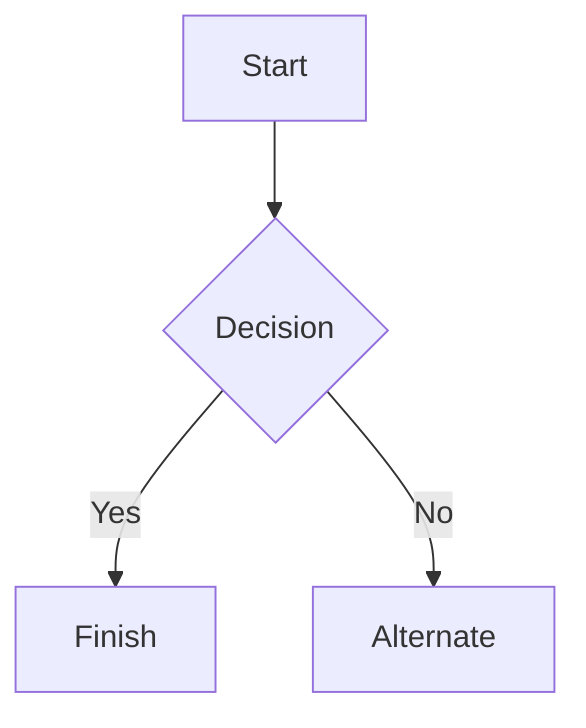

# Welcome to my Blog.
__This is where i post new things I am working on, new things I have learned, and things that are on my mind.__

## What i am currently doing.
Currently i am learning C and WASM because of building this webpage. I tried working in pure Javascript and Html before and i was not enjoying myself. Working in those languages is a messy process that i do not enjoy, but the C Wasm experience is a bit more in my style of programming.

The webpage is built with [Clay](https://github.com/nicbarker/clay), [cJson](https://github.com/DaveGamble/cJSON) and [md4c](https://github.com/mity/md4c).


### Odin
I am also diving into [Odin Lang](https://odin-lang.org/) because I really like the syntax and thought things like Swizzling and the possibility of setting matrix's to different value types like int or uint or f64 and so on is really cool!. Currently trying to Write a Virtual files system in the language, to then either write my own little game engine on the side using SDL3 or Raylib in Odin. I have not picked what backend i want to use yet. but i also might just use the VFS as a library using interop to another library just to try out how i could do that.

I have so far managed to create a custom archive format kind of like Quake 1 used.
figured out how to pack the files, now i just need to implement the reading as well.

### CSharp
I do already have a project working on a csharp raylib engine and i might just implement a Odin interop VFS system for it just for fun!


### This is another test document to make sure the website works correctly.

# Markdown syntax guide

## Headers

# This is a Heading h1
## This is a Heading h2
###### This is a Heading h6

## Emphasis

*This text will be italic*  
_This will also be italic_

**This text will be bold**  
__This will also be bold__

_You **can** combine them_

## Lists

### Unordered

* Item 1
* Item 2
* Item 2a
* Item 2b
    * Item 3a
    * Item 3b

### Ordered

1. Item 1
2. Item 2
3. Item 3
    1. Item 3a
    2. Item 3b

## Images


## Links

You may be using [Markdown Live Preview](https://markdownlivepreview.com/).

## Blockquotes

> Markdown is a lightweight markup language with plain-text-formatting syntax, created in 2004 by John Gruber with Aaron Swartz.
>
>> Markdown is often used to format readme files, for writing messages in online discussion forums, and to create rich text using a plain text editor.

## Tables

| Left columns  | Right columns |
| ------------- |:-------------:|
| left foo      | right foo     |
| left bar      | right bar     |
| left baz      | right baz     |

## Blocks of code

```
let message = 'Hello world';
alert(message);
```

## Mermaid diagrams


## Inline code


