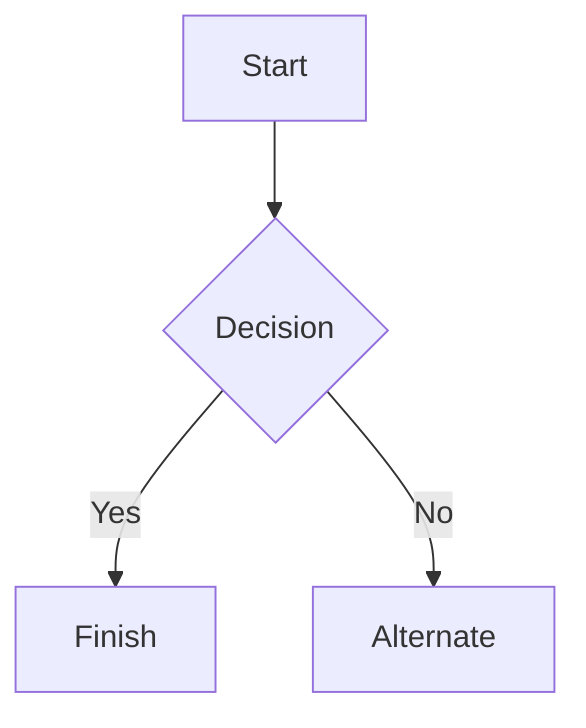

# __Job hunting: Part 1 and side projects.__

As i am currently out of work i am hunting around for places to work.

Sent applications to multiple Game Studios:

### Applications sent to:
- [Zen Studios](https://zenstudios.com/)
- [Spinoff Games](https://spinoffgames.se/)
- [Crg Studios](https://crg.studio/)
- [Frictional Games](https://frictionalgames.com/)
- [Bugbear Entertainment](http://bugbeargames.com/)
- [EA Games / Dice Studios](https://jobs.ea.com/en_US/careers/SearchJobs/?8171=%5B10612%5D&8171_format=5683&listFilterMode=1&jobRecordsPerPage=20&)


### Also sent some Applications to other Jobs:
- [First Camp](https://firstcamp.se/destinationer/arcus-lulea/stugor)
- [Genesis IT](https://www.genesis.se/)
- Ica Kvantum
- Coop
- BDX Green
- Tullverket

## Side Projects:


Currently i am working on MageSlayer SDL and LightningVoid. both of them is being written in Odin lang.

- [Windows_Download](downloads/LightningVoid-Windows.zip)
- [Linux_Download](downloads/LightningVoid-Linux.zip)

I think i have come to really like the language, it has a lot of nice features and forces you to go back to simpler structure.

Here is a LightningVoid screenshot


### This is another test document to make sure the website works correctly.

# Markdown syntax guide

## Headers

# This is a Heading h1
## This is a Heading h2
###### This is a Heading h6

## Emphasis

*This text will be italic*  
_This will also be italic_

**This text will be bold**  
__This will also be bold__

_You **can** combine them_

## Lists

### Unordered

* Item 1
* Item 2
* Item 2a
* Item 2b
    * Item 3a
    * Item 3b

### Ordered

1. Item 1
2. Item 2
3. Item 3
    1. Item 3a
    2. Item 3b

## Images


## Links

You may be using [Markdown Live Preview](https://markdownlivepreview.com/).

## Blockquotes

> Markdown is a lightweight markup language with plain-text-formatting syntax, created in 2004 by John Gruber with Aaron Swartz.
>
>> Markdown is often used to format readme files, for writing messages in online discussion forums, and to create rich text using a plain text editor.

## Tables

| Left columns  | Right columns |
| ------------- |:-------------:|
| left foo      | right foo     |
| left bar      | right bar     |
| left baz      | right baz     |

## Blocks of code

```
let message = 'Hello world';
alert(message);
```

## Mermaid diagrams


## Inline code


